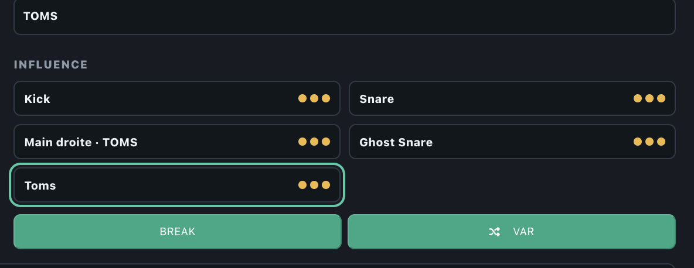

<div align="center">

# 🥁 Battrochtek

### A drum sequencer that plays *with* you.

**Build beats. Explore real grooves. Push them live with FEEL.**

Battrochtek is a browser-based drum workstation for musicians who want the speed of a drum machine, the freedom of a sequencer, and grooves that still feel like they were played by a drummer.

[GitHub](https://github.com/orangejuce82/battrochtek) · MIT licensed · PWA / offline ready

</div>



## Make a beat. Then make it breathe.

Start from a curated groove, program your own pattern, or play the kit from your computer keyboard. Battrochtek keeps the grid immediate and familiar, then adds a performance layer on top instead of forcing you to redraw the beat every time you want more movement.

The heart of the project is **FEEL**: a non-destructive drummer engine that interprets the groove while keeping the original pattern safe underneath.

- **Orchestration** moves from restrained to wild playing styles.
- **Transformation × Density** controls how far the drummer can reshape and enrich the pattern.
- **Swing × Energy** changes how the groove sits and how hard it pushes.
- **Right Hand** lets the groove live naturally on Hi-Hat or Ride, with Open Hat / Ride Bell used as musical colour.
- **Influence** tells FEEL what it is actually allowed to touch: kick, snare, cymbal colour, toms, crash and ghost notes.

Turn FEEL off and the original groove is still there. Turn it back on and the drummer comes back.

## Built for playing, not just programming

Battrochtek is designed to work as both a beat sketchpad and a small live rhythm instrument.

**Break** behaves like a performance gesture: hold it to drop the drums, release it for a style-aware return fill. **Variation** asks the drummer for another interpretation without destroying your pattern. Eight memory slots let you prepare sections, reorder them by drag & drop, duplicate ideas and jump between parts quickly.

The keyboard can be used like a pad controller, notes can be recorded into the running grid with quantization, and editing follows familiar DAW gestures: marquee selection, multi-select, drag, duplicate, velocity editing, undo and redo.

MIDI control is the next natural layer; the internal performance actions are deliberately separated from the UI so they can later be mapped through MIDI Learn, footswitches and expression pedals.

## Grooves with a point of view

Battrochtek does not aim to win by shipping thousands of differently named copies of the same beat.

The groove library is curated around **musically distinct rhythmic archetypes**. Style, phrasing, orchestration and tradition matter. Human performances are used to inform timing and dynamics, while FEEL handles interpretation and variation rather than bloating the library with endless near-duplicates.

That means Rock can feel like Rock, a Jazz ride can breathe differently from a straight Hi-Hat pattern, and traditional rhythmic ideas are not reduced to generic kick/snare templates when their original percussion roles matter.

## Sounds that behave like instruments

The sample engine understands more than a filename. It supports velocity layers, articulations and round-robin playback, including distinctions such as:

**Hi-Hat Closed / Open / Pedal · Ride / Bell · Snare / Cross-stick / Rimshot · Toms · Percussion**

The sound browser is searchable and filterable, with acoustic and electronic kits kept intentionally focused rather than turning the project into a sample warehouse.

## Practice without leaving the groove

The **Training** panel can progressively build a beat layer by layer, move through tempo stages and keep you looping at the target speed. It is useful for learning the library as a drummer, not only listening to it as a programmer.

## Quick start

Battrochtek requires **Node.js 24+**.

```bash
npm install
npm run dev
```

Open:

```text
http://localhost:8000
```

For a production build:

```bash
npm run check
npm run build
```

The generated GitHub Pages build is written to `dist/`.

## A few shortcuts worth knowing

| Action | Shortcut |
|---|---|
| Play / Stop | `Space` |
| Tap tempo | `T` |
| Metronome | `M` |
| Training panel | `L` |
| Velocity | `1` … `5` |
| Select all notes | `Ctrl/Cmd + A` |
| Invert selection | `Ctrl/Cmd + I` |
| Copy / Paste / Duplicate selection | `Ctrl/Cmd + C / V / D` |
| Undo / Redo | `Ctrl/Cmd + Z / Y` |
| FEEL Break / return fill | hold / release `B` |
| New FEEL variation | `V` |
| Next right-hand surface | `H` |
| Next orchestration | `G` |
| Fullscreen sequencer | `Shift + X` |
| Memory 1…8 | `Alt/Option + 1…8` |

There is a complete shortcut panel directly below the sequencer.

## Share a groove, not a project file

Patterns, memories and performance state can travel in the Battrochtek URL. Copy a link or generate a QR code and reopen the same setup in another browser without exporting a session file.

Battrochtek is also installable as a **PWA** and is designed to keep working offline once its assets are cached.

## For contributors

The project deliberately keeps the visible app simple while maintaining validation tools behind it.

```bash
npm test             # smoke tests + kit/sample audits
npm run check        # syntax + lint + tests
npm run build        # GitHub Pages build
npm run grooves:build
```

Technical notes live in `docs/` and the musicology pipeline lives in `musicology/`.

## License & samples

The Battrochtek code is released under the **MIT License**.

Third-party samples keep their original licenses. The project includes openly licensed material such as CC0 sources from Virtuosity / ferrosintesis, Big Rusty Drums and VCSL. See [`THIRD_PARTY_NOTICES.md`](THIRD_PARTY_NOTICES.md) and the sample source metadata for details.

---

<div align="center">

**Battrochtek — write the beat, then let it move.**

</div>
